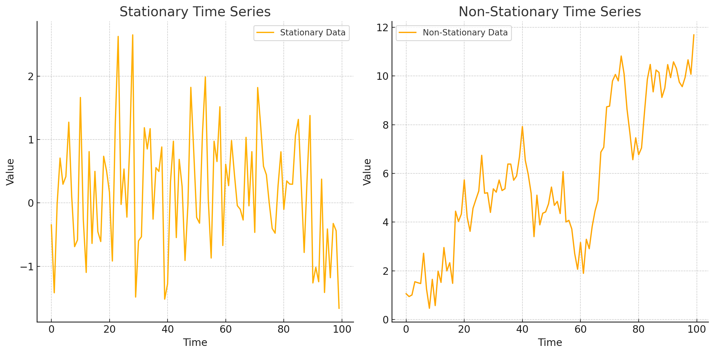

##### 1. if i have time series data , and in this data their is some null value is present, in order to fill those null value, which technique we need to use in machine time series algorithm 

When dealing with missing values in time series data, choosing the appropriate technique to fill those values depends on the nature of the data and the context of the analysis. Here are some common techniques:

1. **Forward Fill (Padding)**:
   - **Description**: The missing value is filled with the most recent non-missing value.
   - **Use Case**: This method works well when you expect the value to remain constant until the next change, such as in financial data where prices may remain stable over short intervals.
  
2. **Backward Fill**:
   - **Description**: The missing value is filled with the next available non-missing value.
   - **Use Case**: Useful in scenarios where a value might be expected to stay the same until a change is observed.

3. **Linear Interpolation**:
   - **Description**: This method estimates missing values by assuming a linear relationship between the known data points before and after the missing value.
   - **Use Case**: Suitable when you expect the data to change gradually over time, such as in temperature or other sensor data.

4. **Seasonal Decomposition**:
   - **Description**: This technique uses seasonal decomposition to estimate missing values based on trends and seasonality components.
   - **Use Case**: Useful when your time series exhibits strong seasonal patterns, like sales data that varies by month or quarter.

5. **Moving Average**:
   - **Description**: Missing values are filled with the average oWhen dealing with missing values in time series data, choosing the appropriate technique to fill those values depends on the nature of the data and the context of the analysis. Here are some common techniques:

1. **Forward Fill (Padding)**:
   - **Description**: The missing value is filled with the most recent non-missing value.
   - **Use Case**: This method works well when you expect the value to remain constant until the next change, such as in financial data where prices may remain stable over short intervals.
  
2. **Backward Fill**:
   - **Description**: The missing value is filled with the next available non-missing value.
   - **Use Case**: Useful in scenarios where a value might be expected to stay the same until a change is observed.

3. **Linear Interpolation**:
   - **Description**: This method estimates missing values by assuming a linear relationship between the known data points before and after the missing value.
   - **Use Case**: Suitable when you expect the data to change gradually over time, such as in temperature or other sensor data.

4. **Seasonal Decomposition**:
   - **Description**: This technique uses seasonal decomposition to estimate missing values based on trends and seasonality components.
   - **Use Case**: Useful when your time series exhibits strong seasonal patterns, like sales data that varies by month or quarter.

5. **Moving Average**:
   - **Description**: Missing values are filled with the average of nearby values within a defined window.
   - **Use Case**: This method can smooth the data and is helpful when short-term fluctuations are not as important.

6. **Using a Model (e.g., ARIMA, Kalman Filter)**:
   - **Description**: More sophisticated methods involve modeling the time series data (e.g., using ARIMA or Kalman filters) and then predicting the missing values based on the model.
   - **Use Case**: These methods are effective when you have a complex time series with patterns that can be captured by a model.

7. **Interpolation using Polynomial or Spline Methods**:
   - **Description**: These methods use higher-order polynomials or splines to estimate missing values.
   - **Use Case**: Effective when the data is non-linear, but should be used with caution to avoid overfitting.

8. **Mean/Median Imputation**:
   - **Description**: Replace missing values with the mean or median of the data.
   - **Use Case**: This method is generally not recommended for time series data as it can distort the time-dependent structure, but might be considered in non-temporal data or as a last resort.

### Recommendations:
- If the missing data is sparse and the time series is smooth, **linear interpolation** is a good starting point.
- If your data has a strong seasonal pattern, consider **seasonal decomposition** or **moving average**.
- For more complex patterns, using a **model-based approach** (like ARIMA) might be the most accurate.

The choice of technique should be guided by the nature of your data, the amount of missing data, and the impact that filling these values will have on your analysis.f nearby values within a defined window.
   - **Use Case**: This method can smooth the data and is helpful when short-term fluctuations are not as important.

6. **Using a Model (e.g., ARIMA, Kalman Filter)**:
   - **Description**: More sophisticated methods involve modeling the time series data (e.g., using ARIMA or Kalman filters) and then predicting the missing values based on the model.
   - **Use Case**: These methods are effective when you have a complex time series with patterns that can be captured by a model.

7. **Interpolation using Polynomial or Spline Methods**:
   - **Description**: These methods use higher-order polynomials or splines to estimate missing values.
   - **Use Case**: Effective when the data is non-linear, but should be used with caution to avoid overfitting.

8. **Mean/Median Imputation**:
   - **Description**: Replace missing values with the mean or median of the data.
   - **Use Case**: This method is generally not recommended for time series data as it can distort the time-dependent structure, but might be considered in non-temporal data or as a last resort.

### Recommendations:
- If the missing data is sparse and the time series is smooth, **linear interpolation** is a good starting point.
- If your data has a strong seasonal pattern, consider **seasonal decomposition** or **moving average**.
- For more complex patterns, using a **model-based approach** (like ARIMA) might be the most accurate.

The choice of technique should be guided by the nature of your data, the amount of missing data, and the impact that filling these values will have on your analysis.

---

#### 2. what is the stationary data and non-stationary data

Sure! Let's go through simple examples of stationary and non-stationary data in the context of time series analysis:

### 1. **Stationary Data**
Stationary data is characterized by statistical properties, such as mean, variance, and autocorrelation, that are constant over time. 

#### Example:
Imagine a dataset representing the daily temperature deviation from a long-term average temperature over a year in a city.

| Day | Temperature Deviation (°C) |
|-----|----------------------------|
| 1   | 0.5                        |
| 2   | -0.2                       |
| 3   | 0.1                        |
| 4   | 0.0                        |
| 5   | -0.3                       |
| 6   | 0.4                        |
| 7   | -0.1                       |

In this example, the deviations oscillate around 0°C, and the overall mean and variance of the deviations remain constant over time. The data doesn't show any particular trend or seasonality, making it **stationary**.

### 2. **Non-Stationary Data**
Non-stationary data has statistical properties that change over time, such as a trend, seasonality, or varying variance.

#### Example:
Consider a dataset representing the daily closing price of a stock over a year.

| Day | Closing Price (USD) |
|-----|---------------------|
| 1   | 50                  |
| 2   | 51                  |
| 3   | 52                  |
| 4   | 53                  |
| 5   | 55                  |
| 6   | 57                  |
| 7   | 60                  |

In this example, the stock price shows an increasing trend over time. The mean is not constant, and the variance might also change as the prices increase. This dataset exhibits a **non-stationary** behavior because of the upward trend.

### Summary:
- **Stationary Data**: The daily temperature deviation example, where the mean and variance remain constant over time.
- **Non-Stationary Data**: The stock price example, where there is a clear trend, indicating changing statistical properties over time.

In machine learning, understanding whether your data is stationary or non-stationary is crucial because many algorithms assume stationarity. Non-stationary data often needs to be transformed (e.g., differencing) to make it stationary before applying certain models, like ARIMA.

### Here are the examples of non-stationary data:

1. **Stationary Data** (left plot): This data has constant statistical properties over time, like mean and variance. In the example, it's represented by random noise, where the values fluctuate around a constant mean.

2. **Non-Stationary Data** (right plot): This data has changing statistical properties over time. The example shown is a random walk, where the values accumulate over time, leading to a trend, and the mean and variance change as time progresses. 

In machine learning, stationary data is often preferred for time series analysis as many models assume stationarity. Non-stationary data often needs to be transformed (e.g., through differencing) to become stationary.

---
### 3. Time series algorithm includes how many types of data set?

Time series data is used in various fields to analyze data points collected or recorded at specific time intervals. Different types of time series datasets can be used depending on the problem you are trying to solve. Here’s a breakdown of common types of time series datasets:

1. **Univariate Time Series**:
   - **Single Variable**: Contains data on one variable over time. Example: daily temperature readings, stock prices.
   - **Examples**: Monthly sales figures, daily temperature, daily closing price of a stock.

2. **Multivariate Time Series**:
   - **Multiple Variables**: Contains data on multiple variables or features over time. Example: stock prices with trading volume and interest rates.
   - **Examples**: Economic indicators (GDP, unemployment rate, inflation rate), weather data (temperature, humidity, wind speed).

3. **Seasonal Time Series**:
   - **Seasonality**: Data that exhibits regular and predictable changes that recur every calendar year or other fixed period. Example: retail sales that increase during holiday seasons.
   - **Examples**: Monthly electricity consumption, annual rainfall patterns.

4. **Non-Stationary Time Series**:
   - **Trend and Seasonality**: Data that shows trends (upward or downward) and/or seasonality. Example: rising housing prices over years with seasonal fluctuations.
   - **Examples**: Population growth data, long-term financial trends.

5. **Stationary Time Series**:
   - **No Trend or Seasonality**: Data that does not exhibit trends or seasonality and has a constant statistical property over time. Example: daily returns of a stock.
   - **Examples**: Daily sales data for a product with stable demand, temperature in a controlled environment.

6. **Temporal Data with Irregular Intervals**:
   - **Irregular Time Points**: Data points collected at irregular intervals. Example: sensor data from machines that only records when there’s an anomaly.
   - **Examples**: Event logs from servers, customer support tickets timestamps.

7. **Longitudinal Data**:
   - **Repeated Measures**: Data collected from the same subjects over multiple time points. Example: patient health metrics measured at several visits.
   - **Examples**: Clinical trial data, cohort study data.

8. **Hierarchical Time Series**:
   - **Multiple Levels**: Time series data that are organized in a hierarchical structure, such as time series data for different geographical locations. Example: sales data for various regions of a company.
   - **Examples**: Sales data at the store level, regional level, and national level.

9. **Panel Data (or Cross-Sectional Time Series Data)**:
   - **Multiple Entities**: Data collected over time for multiple entities or units. Example: quarterly earnings for several companies.
   - **Examples**: Economic data for different countries over several years, employee performance metrics over time.

10. **Anomaly Detection Time Series**:
    - **Anomalies or Outliers**: Data where anomalies or deviations from the norm are of particular interest. Example: detecting fraud in credit card transactions.
    - **Examples**: Network traffic data for detecting security breaches, industrial equipment sensor data for detecting malfunctions.

11. **Financial Time Series**:
    - **Market Data**: Data related to financial markets. Example: daily stock prices, trading volume.
    - **Examples**: Historical stock prices, cryptocurrency prices, forex rates.

12. **Transactional Data**:
    - **Event Logs**: Data generated from transactions or events. Example: purchase logs, clickstream data.
    - **Examples**: E-commerce transaction logs, web server access logs.

13. **Sensor Data**:
    - **Continuous Monitoring**: Data from sensors measuring physical quantities. Example: temperature readings from a sensor network.
    - **Examples**: IoT device data, environmental sensor data.

Each type of dataset may require different preprocessing steps and modeling approaches to handle specific characteristics such as seasonality, trends, or irregular intervals.
